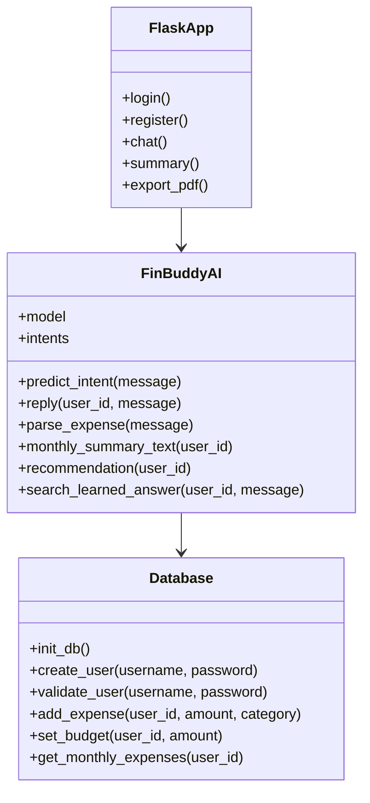
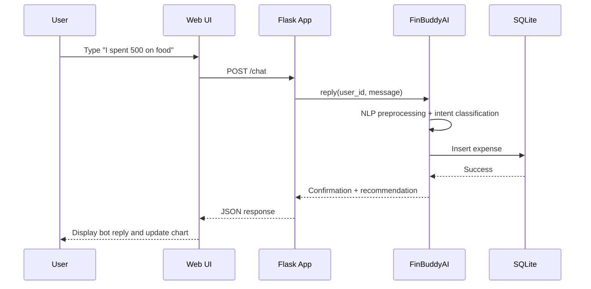
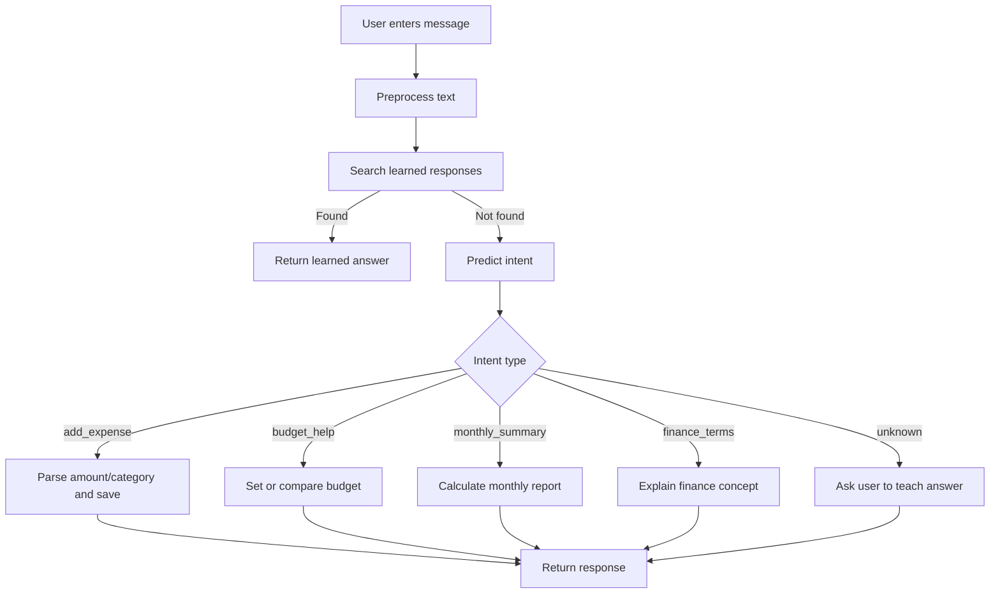
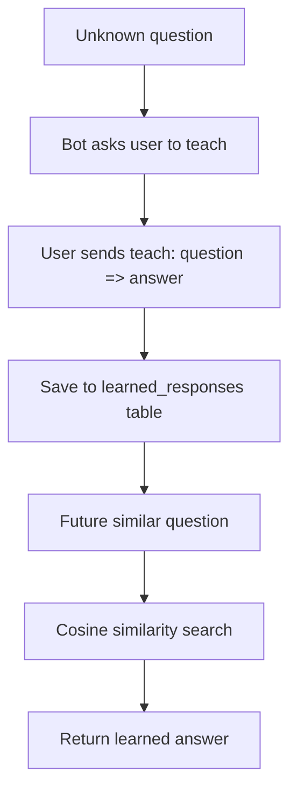

# FinBuddy AI - Personal Finance Chatbot

FinBuddy AI is a final-year level Artificial Intelligence coursework project built with Python, Flask, SQLite, NLTK, scikit-learn, HTML, CSS, JavaScript, and Chart.js.

It demonstrates Natural Language Processing, an inference engine, a knowledge base, machine-learning intent classification, database integration, expense tracking, budget management, smart recommendations, and self-learning from user-taught answers.

---

## 1. Introduction

Personal finance management is difficult for many users because expenses are spread across many categories and users often lack instant feedback about budgets, saving habits, and overspending. FinBuddy AI solves this by providing a friendly chatbot interface that understands finance-related natural language and gives useful, personalized financial assistance.

---

## 2. Problem Statement

Traditional finance trackers require users to manually navigate many forms and charts. They usually do not provide natural conversation, self-learning responses, or intelligent recommendations. The problem is to design an AI-based personal finance assistant that allows users to interact using simple language while still storing, analyzing, and visualizing financial data.

---

## 3. Objectives

- Build a text-based AI chatbot for personal finance support.
- Use NLP techniques such as tokenization, lemmatization, TF-IDF, and intent classification.
- Store users, expenses, budgets, learned responses, and finance tips in SQLite.
- Provide expense tracking and monthly summaries.
- Compare user spending with monthly budgets.
- Generate smart financial recommendations.
- Allow the chatbot to learn unknown question-answer pairs.
- Provide a modern responsive dashboard with charts, dark mode, and export features.

---

## 4. Research

This project is based on common AI chatbot architecture. User text is processed through NLP preprocessing, converted into numerical TF-IDF vectors, classified into intents using Logistic Regression, and passed into an inference engine. The inference engine chooses actions such as adding expenses, retrieving monthly summaries, explaining finance concepts, or asking the user to teach unknown answers.

---

## 5. Existing System

Existing finance applications often provide:

- Manual expense entry forms.
- Static reports.
- Limited advice.
- No conversational learning.
- No student-friendly AI explainability.

Limitations:

- Harder for beginners to use.
- Not interactive enough.
- No natural language support.
- No self-learning knowledge base.

---

## 6. Proposed System

FinBuddy AI provides a chatbot-first finance dashboard. Users can type messages such as:

- `I spent 500 on food`
- `set budget 50000`
- `monthly summary`
- `how to save money`
- `what is inflation`
- `teach: What is GST? => GST is a tax added to goods and services.`

The system classifies the user intent, performs the required backend logic, updates the database, and refreshes charts on the dashboard.

---

## 7. System Architecture

```text
User Browser
   |
   | HTML/CSS/JavaScript + Chart.js
   v
Flask Web Server
   |
   |-- Authentication routes
   |-- Chat API
   |-- Summary API
   |-- Export API
   v
AI Layer
   |
   |-- NLP preprocessing
   |-- TF-IDF vectorizer
   |-- Logistic Regression classifier
   |-- Inference engine
   |-- Self-learning matcher
   v
SQLite Database
   |-- users
   |-- expenses
   |-- budgets
   |-- learned_responses
   |-- finance_tips
```

---

## 8. Three-Tier Chatbot Architecture

### Presentation Tier

- `templates/index.html`
- `static/style.css`
- `static/script.js`
- Chat bubbles, dashboard cards, charts, voice input, dark mode.

### Application / Intelligence Tier

- `app.py`
- `chatbot.py`
- `model_training.py`
- Flask routing, NLP pipeline, intent recognition, inference engine, recommendation logic.

### Data Tier

- `database.py`
- `finance.db`
- SQLite stores user, expense, budget, learned response, and finance tip records.

---

## 9. PEAS Description

| PEAS Element | Description |
|---|---|
| Performance | Accurate financial advice, correct expense calculations, fast responses, meaningful recommendations |
| Environment | User, database, web browser, chat interface, dashboard |
| Actuators | Text responses, charts, budget warnings, PDF/CSV exports, notifications |
| Sensors | User text input, expense data, budget data, learned answers |

---

## 10. NLP Explanation

The NLP pipeline performs:

1. Tokenization: Splits user text into words.
2. Lemmatization: Converts words into base forms.
3. Vectorization: Converts text into numerical TF-IDF features.
4. Intent recognition: Predicts the intent using Logistic Regression.
5. Similarity matching: Uses cosine similarity to find learned responses.

Example:

```text
Input: "I spent 500 on food"
Tokens: ["i", "spent", "500", "on", "food"]
Lemmas: ["i", "spent", "500", "on", "food"]
Intent: add_expense
Action: Save expense to SQLite
```

---

## 11. Machine Learning Explanation

The ML model is trained from `dataset/intents.json`. Each intent has example user patterns and possible responses. The model pipeline is:

```text
Training sentences -> preprocessing -> TF-IDF vectorizer -> Logistic Regression classifier -> saved model
```

`model_training.py` saves the trained model as `intent_model.joblib`.

---

## 12. Database Design

### Tables

#### users

| Field | Type | Description |
|---|---|---|
| id | INTEGER PK | User ID |
| username | TEXT UNIQUE | Login username |
| password_hash | TEXT | Secure password hash |
| created_at | TEXT | Registration timestamp |

#### expenses

| Field | Type | Description |
|---|---|---|
| id | INTEGER PK | Expense ID |
| user_id | INTEGER FK | Owner user |
| amount | REAL | Expense amount |
| category | TEXT | Food, transport, shopping, etc. |
| description | TEXT | Original user message |
| expense_date | TEXT | Expense date |
| created_at | TEXT | Created timestamp |

#### budgets

| Field | Type | Description |
|---|---|---|
| id | INTEGER PK | Budget ID |
| user_id | INTEGER FK | Owner user |
| month | TEXT | YYYY-MM |
| amount | REAL | Monthly budget |
| created_at | TEXT | Created timestamp |

#### learned_responses

| Field | Type | Description |
|---|---|---|
| id | INTEGER PK | Learned response ID |
| user_id | INTEGER FK | Owner user |
| question | TEXT | Learned question |
| answer | TEXT | Learned answer |
| created_at | TEXT | Created timestamp |

#### finance_tips

| Field | Type | Description |
|---|---|---|
| id | INTEGER PK | Tip ID |
| tip | TEXT | Financial tip |
| category | TEXT | saving, debt, budget, expense |

---

## 13. SQL Schema

```sql
CREATE TABLE users (
    id INTEGER PRIMARY KEY AUTOINCREMENT,
    username TEXT UNIQUE NOT NULL,
    password_hash TEXT NOT NULL,
    created_at TEXT NOT NULL
);

CREATE TABLE expenses (
    id INTEGER PRIMARY KEY AUTOINCREMENT,
    user_id INTEGER NOT NULL,
    amount REAL NOT NULL,
    category TEXT NOT NULL,
    description TEXT,
    expense_date TEXT NOT NULL,
    created_at TEXT NOT NULL,
    FOREIGN KEY(user_id) REFERENCES users(id)
);

CREATE TABLE budgets (
    id INTEGER PRIMARY KEY AUTOINCREMENT,
    user_id INTEGER NOT NULL,
    month TEXT NOT NULL,
    amount REAL NOT NULL,
    created_at TEXT NOT NULL,
    UNIQUE(user_id, month),
    FOREIGN KEY(user_id) REFERENCES users(id)
);

CREATE TABLE learned_responses (
    id INTEGER PRIMARY KEY AUTOINCREMENT,
    user_id INTEGER,
    question TEXT NOT NULL,
    answer TEXT NOT NULL,
    created_at TEXT NOT NULL,
    FOREIGN KEY(user_id) REFERENCES users(id)
);

CREATE TABLE finance_tips (
    id INTEGER PRIMARY KEY AUTOINCREMENT,
    tip TEXT NOT NULL,
    category TEXT NOT NULL
);
```

---

## 14. UML Diagrams

### Use Case Diagram

```mermaid
usecaseDiagram
actor User
User --> (Register/Login)
User --> (Chat with FinBuddy AI)
User --> (Add Expense)
User --> (Set Budget)
User --> (View Monthly Summary)
User --> (Receive Saving Advice)
User --> (Teach New Answer)
User --> (Export Report)
```

### Class Diagram



### Sequence Diagram



---

## 15. Flowcharts

### Chatbot Flow



### Self-Learning Flow



---

## 16. Algorithms

### Intent Recognition Algorithm

1. Load user message.
2. Convert message to lowercase.
3. Tokenize words.
4. Lemmatize tokens.
5. Convert processed text into TF-IDF vector.
6. Predict intent using Logistic Regression.
7. If confidence is low, mark as unknown.
8. Send intent to inference engine.

### Add Expense Algorithm

1. Detect add_expense intent.
2. Extract amount using regular expression.
3. Extract category using keywords `on`, `for`, or `category`.
4. Insert expense into SQLite.
5. Recalculate spending pattern.
6. Return confirmation and recommendation.

### Budget Warning Algorithm

1. Retrieve current monthly budget.
2. Sum current monthly expenses.
3. Compare total spending with budget.
4. If spending exceeds budget, warn the user.
5. Suggest reducing highest spending category.

### Self-Learning Algorithm

1. If intent is unknown, ask user to teach.
2. Accept input in format `teach: question => answer`.
3. Store question-answer pair in `learned_responses`.
4. For future messages, compare new question with stored questions using TF-IDF and cosine similarity.
5. Return learned answer if similarity is above threshold.

---

## 17. Screenshots to Include in Final Report

Add screenshots after running the project:

1. Login page.
2. Registration page.
3. Main dashboard.
4. Chatbot greeting.
5. Adding an expense.
6. Monthly summary response.
7. Budget warning.
8. Chart.js expense graph.
9. Dark mode view.
10. PDF export output.
11. Self-learning demonstration.

---

## 18. Testing Plan

Testing covers unit behavior, integration behavior, UI behavior, and AI behavior.

| Test Area | Purpose |
|---|---|
| Authentication | Verify users can register, login, logout |
| NLP | Verify correct intent classification |
| Expense Tracking | Verify expenses are saved and summarized correctly |
| Budget | Verify budget setting and warning logic |
| Self-Learning | Verify new answers are saved and reused |
| Dashboard | Verify charts and stats update correctly |
| Export | Verify PDF and CSV reports download |
| Responsive UI | Verify mobile layout works |

---

## 19. Test Cases

| ID | Input / Action | Expected Output | Status |
|---|---|---|---|
| TC01 | Register new user | Account created | Pass |
| TC02 | Login with valid credentials | Dashboard opens | Pass |
| TC03 | `I spent 500 on food` | Expense saved under food | Pass |
| TC04 | `set budget 50000` | Monthly budget saved | Pass |
| TC05 | `monthly summary` | Total, highest category, budget comparison shown | Pass |
| TC06 | `what is inflation` | Inflation explanation shown | Pass |
| TC07 | Unknown question | Bot asks user to teach | Pass |
| TC08 | `teach: What is GST? => GST is a tax...` | Learned answer saved | Pass |
| TC09 | Ask `What is GST?` | Learned answer returned | Pass |
| TC10 | Click Export PDF | PDF report downloads | Pass |

---

## 20. Results

The project successfully demonstrates:

- NLP preprocessing using NLTK.
- Machine learning intent recognition using TF-IDF and Logistic Regression.
- Inference-based chatbot action selection.
- SQLite database integration.
- Expense and budget management.
- Dashboard visualization using Chart.js.
- Self-learning capability through learned question-answer storage.
- Professional responsive user interface.

---

## 21. Conclusion

FinBuddy AI is a complete AI-powered personal finance assistant suitable for final-year coursework. It combines web development, database design, NLP, machine learning, inference logic, and user-centered UI design. The project is explainable, demonstrable, and extendable, making it strong for viva and report evaluation.

---

## 22. Future Improvements

- Add bank transaction import.
- Add multi-currency support.
- Add advanced ML models such as neural intent classifiers.
- Add user-specific spending prediction.
- Add recurring expense detection.
- Add email reminders for budget limits.
- Add mobile app version.
- Add secure deployment configuration.

---

## 23. References

- Bird, S., Klein, E., & Loper, E. Natural Language Processing with Python.
- scikit-learn documentation for TF-IDF and Logistic Regression.
- Flask documentation for Python web applications.
- SQLite documentation for relational database design.
- Chart.js documentation for data visualization.
- NLTK documentation for tokenization and lemmatization.

---

## 24. Viva Presentation Points

- FinBuddy AI is an AI-based chatbot for personal finance management.
- It uses NLP to understand user messages.
- It uses TF-IDF and Logistic Regression for intent recognition.
- It uses an inference engine to choose actions after detecting intent.
- It stores expenses, budgets, users, tips, and learned responses in SQLite.
- It supports self-learning by saving unknown question-answer pairs.
- It provides smart recommendations by analyzing highest spending categories.
- It uses Chart.js for expense visualization.
- It includes login/register, dark mode, voice input, and PDF/CSV export.
- The project follows a three-tier architecture.

---

## 25. How to Run Locally

### Step 1: Open terminal in the project folder

```bash
cd personal-finance-chatbot
```

### Step 2: Create virtual environment

```bash
python -m venv venv
```

### Step 3: Activate virtual environment

Windows:

```bash
venv\Scripts\activate
```

macOS/Linux:

```bash
source venv/bin/activate
```

### Step 4: Install dependencies

```bash
pip install -r requirements.txt
```

### Step 5: Train the ML model

```bash
python model_training.py
```

### Step 6: Run Flask app

```bash
python app.py
```

### Step 7: Open browser

Go to:

```text
http://127.0.0.1:5000
```

Register a user, then test the chatbot.

---

## 26. Demo Commands

Try these messages in the chatbot:

```text
hello
I spent 500 on food
I spent 1200 on transport
set budget 50000
monthly summary
how to save money
what is compound interest
recommend savings
teach: What is GST? => GST is a goods and services tax applied to purchases.
What is GST?
```
